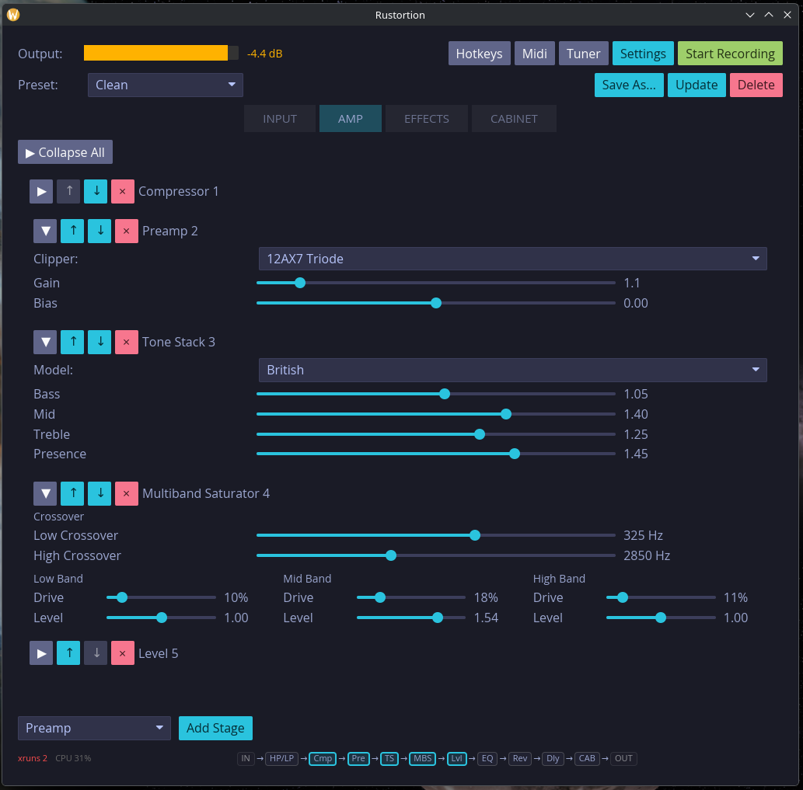

# Rustortion

A guitar amp simulator built in Rust using JACK.

## Screenshot



## Features

- Low-latency audio processing with oversampling
- Multiple amp simulation stages (preamp, compressor, tone stack, power amp, etc.)
- Impulse response (IR) cabinet simulation
- Save and load presets
- Real-time recording capability
- Built-in tuner
- GUI using [Iced](https://github.com/iced-rs/iced)

## Requirements

- **Linux** with PipeWire (JACK support enabled)
- **Rust** toolchain: [Install Rust](https://rustup.rs/)
> [!NOTE]
> It may be possible without PipeWire, but that's not been tested yet. [See this issue.](https://github.com/OpenSauce/rustortion/issues/100)

## Running

### Prebuilt Binary

You can download a tarball of a pre-built binary from the [releases page.](https://github.com/OpenSauce/rustortion/releases/)

```bash
sudo apt-get install libjack-jackd2-0
tar -xf rustortion-x86_64-unknown-linux-gnu.tar.xz
cd rustortion-x86_64-unknown-linux-gnu
./rustortion
```

### Running/Building from Source

With the rust toolchain installed, you can clone the repository and run the application:
```bash
sudo apt-get install libjack-jackd2-dev pkg-config
cargo run --release
// on some linux machines with pipewire you have to run jack explicitly
// dont forget to install pipewire jack emulator: sudo apt-get install pipewire-jack
pw-jack cargo run --release
```

## Contributing

This is an experimental project. Feel free to open issues or submit pull requests.

## License

This project is provided under the **MIT License**.
Rustortion is under active development and should be used at your own risk.

### Impulse Responses

This project includes freely licensed impulse responses from [freesound.org](https://freesound.org/):

- [Multiple Cabinets – Jesterdyne](https://freesound.org/people/jesterdyne/)
- [Harley Benton 4x12 – Vihaleipa](https://freesound.org/people/Vihaleipa/sounds/269662/)
- [Bristol Mix – Mansardian](https://freesound.org/people/mansardian/sounds/648392/)
- [Brown Cab – Tosha73](https://freesound.org/people/tosha73/sounds/507167/)
