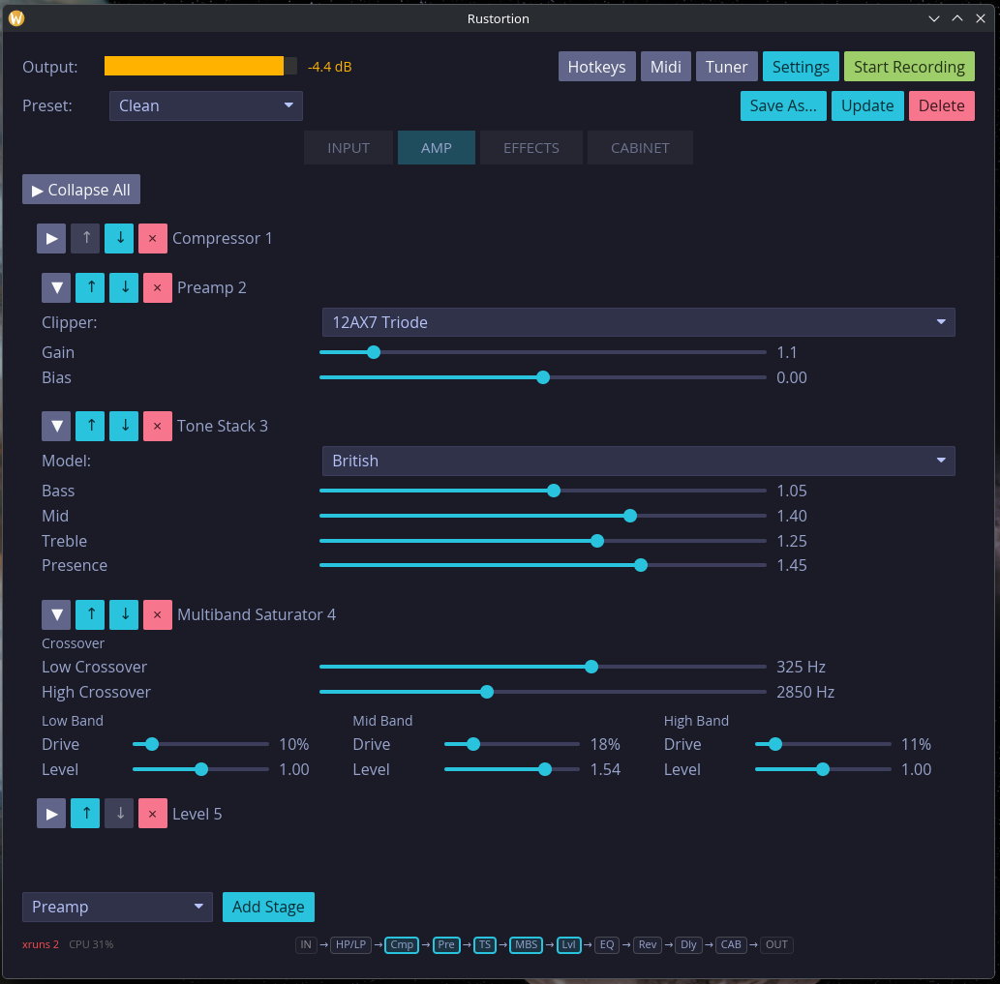

# Rustortion

English | [简体中文](README.zh-CN.md)

A guitar amp simulator built in Rust using JACK.

## Screenshot



## Features

- Low-latency audio processing with configurable oversampling (1x–16x)
- 10 DSP stages: preamp (with 12AX7 triode clipper), compressor, tone stack, power amp, noise gate, level, multi-band saturator, delay, reverb, and 16-band graphic EQ
- Impulse response cabinet simulation for both guitar and bass
- Saving and loading presets with keyboard hotkey switching
- Real-time recording capability
- Built-in tuner
- FFT-based pitch shifting for alternate tunings without retuning your instrument
- MIDI controller support
- Tabbed GUI with minimap, collapsible stage cards, and input filter controls - built with [Iced](https://github.com/iced-rs/iced)

## Requirements

- **Linux** with PipeWire (JACK support enabled)
- **Rust** toolchain: [Install Rust](https://rustup.rs/)

> [!NOTE]
> This has been tested on a Raspberry Pi 4 and reasonably high end desktop PC. Your mileage may vary on other hardware.

## Running

### Pre-built Binary

You can download a tarball of a pre-built binary from the [releases page.](https://github.com/OpenSauce/rustortion/releases/)

```bash
sudo apt-get install libjack-jackd2-0
tar -xf rustortion-x86_64-unknown-linux-gnu.tar.xz
cd rustortion-x86_64-unknown-linux-gnu
./rustortion
```

### Running/Building from Source

With the rust toolchain installed, you can clone the repository and run the application:
```bash
sudo apt-get install libjack-jackd2-dev libasound2-dev pkg-config
cargo run --release
```

> [!TIP]
> On some Linux machines with PipeWire, you may need to run JACK explicitly:
> ```bash
> sudo apt-get install pipewire-jack
> pw-jack cargo run --release
> ```

## Contributing

This is an experimental project. Feel free to open issues or submit pull requests.

## License

This project is provided under the **MIT License**.
Rustortion is under active development and should be used at your own risk.

### Impulse Responses

#### Science Amplification

This project includes impulse responses used with permission from [Science Amplification](https://www.scienceamps.com/).

#### Other

This project also includes freely licensed impulse responses from [freesound.org](https://freesound.org/):

- [Multiple Cabinets – Jesterdyne](https://freesound.org/people/jesterdyne/)
- [Bristol Mix – Mansardian](https://freesound.org/people/mansardian/sounds/648392/)
- [Brown Cab – Tosha73](https://freesound.org/people/tosha73/sounds/507167/)

