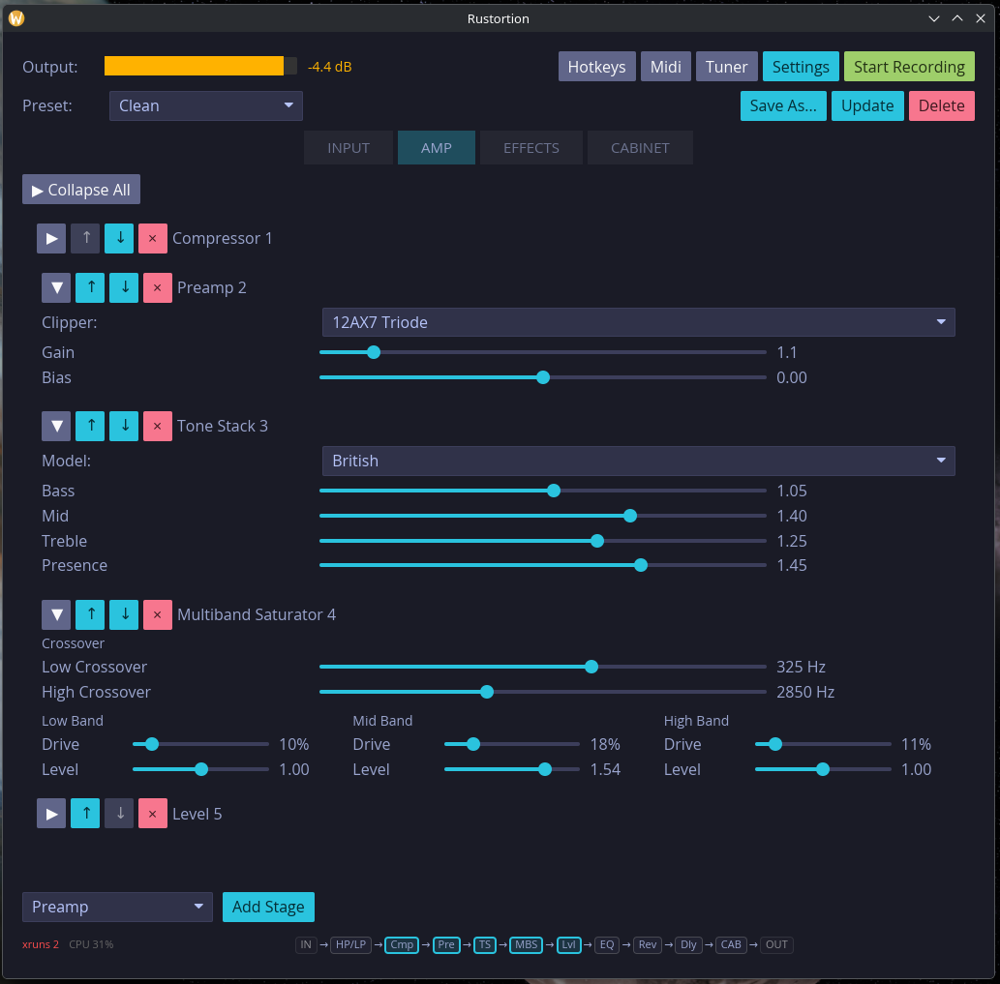

# Rustortion

English | [简体中文](README.zh-CN.md)


A guitar and bass amp simulator built in Rust. Runs standalone with JACK, or as a VST3/CLAP plugin in your DAW.

## Screenshot



## Features

- Low-latency audio processing with configurable oversampling (1x–16x)
- 12 DSP stages: preamp (with 12AX7 triode clipper), compressor, tone stack, power amp, noise gate, level, multi-band saturator, delay, reverb, tremolo, 16-band graphic EQ, and NAM (Neural Amp Modeler) model loading (WaveNet + LSTM `.nam` files)
- Per-stage bypass and stage reordering within the chain
- Impulse response cabinet simulation for both guitar and bass
- Saving and loading presets with keyboard hotkey switching
- Real-time recording capability
- Built-in tuner
- FFT-based pitch shifting for alternate tunings without retuning your instrument
- MIDI controller support
- VST3 and CLAP plugin builds for DAW use — see [Plugin](#vst3clap-plugin)
- Tabbed GUI with minimap, collapsible stage cards, and input filter controls - built with [Iced](https://github.com/iced-rs/iced)
- English and Simplified Chinese UI

## Requirements

- **Linux** with PipeWire (JACK support enabled)
- **Rust** toolchain: [Install Rust](https://rustup.rs/)

> [!NOTE]
> This has been tested on a Raspberry Pi 4 and reasonably high end desktop PC. Your mileage may vary on other hardware.

## Running

### Pre-built Binary

You can download a tarball of a pre-built binary from the [releases page.](https://github.com/OpenSauce/rustortion/releases/)

```bash
sudo apt-get install libjack-jackd2-0
tar -xf rustortion-standalone-x86_64-unknown-linux-gnu.tar.xz
cd rustortion-standalone-x86_64-unknown-linux-gnu
./rustortion
```

> [!NOTE]
> The standalone archive was named `rustortion-<target>.tar.xz` up to v0.2.0. From v0.3.0 it is
> `rustortion-standalone-<target>.tar.xz`, following the crate rename. The binary inside is still
> `rustortion`. Substitute `aarch64` for `x86_64` on a Raspberry Pi.

### Running/Building from Source

With the rust toolchain installed, you can clone the repository and run the application:
```bash
sudo apt-get install libjack-jackd2-dev libasound2-dev pkg-config
cargo run --release
```

> [!TIP]
> On some Linux machines with PipeWire, you may need to run JACK explicitly:
> ```bash
> sudo apt-get install pipewire-jack
> pw-jack cargo run --release
> ```

### VST3/CLAP Plugin

Rustortion also ships as an audio plugin in two formats: **CLAP** (`Rustortion.clap`) and
**VST3** (`Rustortion.vst3`). Both are built from the same code and expose the same GUI as the
standalone app.

Bundles are published for three targets:

| Download | Platform | Status |
|---|---|---|
| `Rustortion-linux-x86_64.zip` | Linux x86_64 | Tested in a DAW |
| `Rustortion-linux-aarch64.zip` | Linux aarch64 (Raspberry Pi) | Builds in CI, not hand-tested |
| `Rustortion-windows-x86_64.zip` | Windows x86_64 | Builds in CI, not hand-tested |

> [!NOTE]
> The aarch64 and Windows bundles are built natively in CI on every release, but have not been
> loaded in a DAW by hand. They should work; if one doesn't, please open an issue. There is no
> macOS build — it needs an Apple Developer ID for signing and notarization, without which a DAW
> will refuse to load the plugin.

Download the archive for your platform from the
[releases page](https://github.com/OpenSauce/rustortion/releases/) and unpack both bundles into
your plugin folders:

On Linux (substitute `aarch64` for `x86_64` on a Pi):

```bash
sudo apt-get install libjack-jackd2-0
unzip Rustortion-linux-x86_64.zip
mkdir -p ~/.clap ~/.vst3
cp -r Rustortion.clap ~/.clap/
cp -r Rustortion.vst3 ~/.vst3/
```

`~/.clap` and `~/.vst3` are the standard per-user plugin directories on Linux; most hosts scan
them by default.

On Windows, unzip `Rustortion-windows-x86_64.zip` and copy `Rustortion.clap` into
`%COMMONPROGRAMFILES%\CLAP` and `Rustortion.vst3` into `%COMMONPROGRAMFILES%\VST3` (typically
`C:\Program Files\Common Files\`).

Rescan plugins in your DAW afterwards.

To build the plugin from source instead:

```bash
make plugin           # builds target/bundled/Rustortion.{clap,vst3}
make plugin-install   # copies them into ~/.clap and ~/.vst3
```

## Contributing

This is an experimental project. Feel free to open issues or submit pull requests.

## License

This project is provided under the **MIT License**.
Rustortion is under active development and should be used at your own risk.

### Impulse Responses

#### Science Amplification

This project includes impulse responses used with permission from [Science Amplification](https://www.scienceamps.com/).

#### Other

This project also includes freely licensed impulse responses from [freesound.org](https://freesound.org/):

- [Multiple Cabinets – Jesterdyne](https://freesound.org/people/jesterdyne/)
- [Bristol Mix – Mansardian](https://freesound.org/people/mansardian/sounds/648392/)
- [Brown Cab – Tosha73](https://freesound.org/people/tosha73/sounds/507167/)

