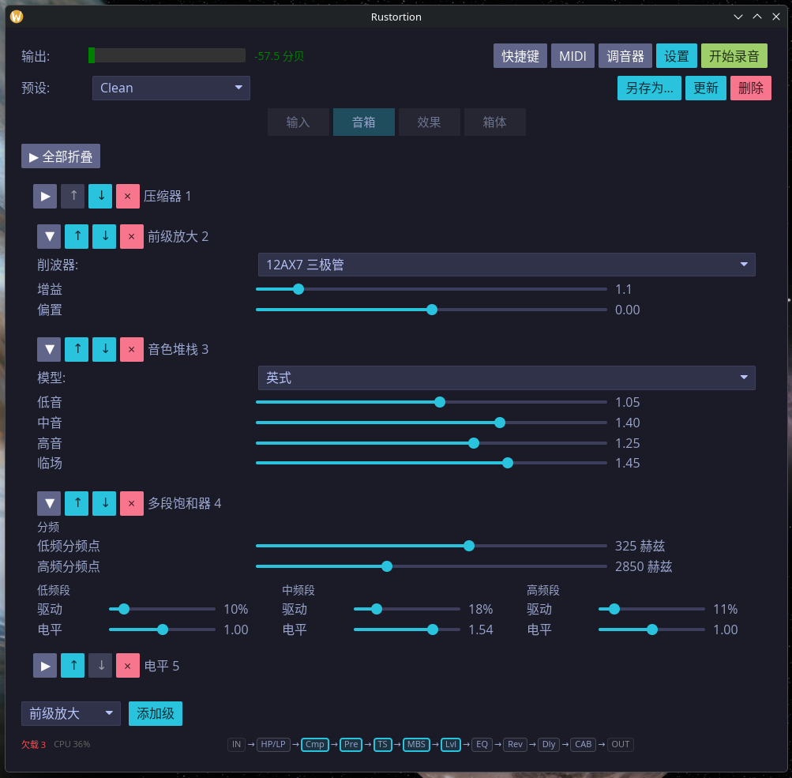

# Rustortion

[English](README.md) | 简体中文


一款使用 Rust 构建的吉他/贝斯音箱模拟器。可作为 JACK 独立应用运行，也可作为 VST3/CLAP 插件在 DAW 中使用。

## 截图



## 功能特性

- 低延迟音频处理，支持可配置的过采样（1x–16x）
- 12 个 DSP 处理级：前级放大（含 12AX7 三极管削波器）、压缩器、音色堆栈、后级放大、噪声门、电平、多频段饱和器、延迟、混响、颤音、16 频段图形均衡器，以及 NAM（Neural Amp Modeler）模型加载（支持 WaveNet 与 LSTM 的 `.nam` 文件）
- 支持单个处理级旁通，以及在链中调整处理级顺序
- 支持吉他和贝斯的脉冲响应箱体模拟
- 预设的保存与加载，支持键盘快捷键切换
- 实时录音功能
- 内置调音器
- 基于 FFT 的变调功能，无需重新调弦即可切换至不同调音
- MIDI 控制器支持
- VST3 与 CLAP 插件构建，可在 DAW 中使用 — 参见[插件](#vst3clap-插件)
- 标签式界面，支持缩略图、可折叠级卡片和输入滤波器控制 - 使用 [Iced](https://github.com/iced-rs/iced) 构建
- 界面支持英文与简体中文

## 系统要求

- **Linux** 系统，需启用 PipeWire（开启 JACK 支持）
- **Rust** 工具链：[安装 Rust](https://rustup.rs/)

> [!NOTE]
> 本项目已在 Raspberry Pi 4 和较高配置的台式电脑上测试通过。在其他硬件上的表现可能有所不同。

## 运行方式

### 预编译二进制文件

您可以从 [发布页面](https://github.com/OpenSauce/rustortion/releases/) 下载预编译的二进制压缩包。

```bash
sudo apt-get install libjack-jackd2-0
tar -xf rustortion-x86_64-unknown-linux-gnu.tar.xz
cd rustortion-x86_64-unknown-linux-gnu
./rustortion
```

### 从源码运行/编译

安装好 Rust 工具链后，您可以克隆仓库并运行应用程序：

```bash
sudo apt-get install libjack-jackd2-dev libasound2-dev pkg-config
cargo run --release
```

> [!TIP]
> 在某些使用 PipeWire 的 Linux 机器上，您可能需要显式运行 JACK：
> ```bash
> sudo apt-get install pipewire-jack
> pw-jack cargo run --release
> ```

### VST3/CLAP 插件

Rustortion 同时以两种插件格式发布：**CLAP**（`Rustortion.clap`）与 **VST3**（`Rustortion.vst3`）。
两者由同一份代码构建，并提供与独立版应用相同的图形界面。

目前发布以下三个目标平台的插件包：

| 下载文件 | 平台 | 状态 |
|---|---|---|
| `Rustortion-linux-x86_64.zip` | Linux x86_64 | 已在 DAW 中实机测试 |
| `Rustortion-linux-aarch64.zip` | Linux aarch64（树莓派） | CI 构建通过，未经实机测试 |
| `Rustortion-windows-x86_64.zip` | Windows x86_64 | CI 构建通过，未经实机测试 |

> [!NOTE]
> aarch64 与 Windows 插件包会在每次发布时由 CI 原生构建，但尚未在 DAW 中人工加载测试。
> 它们理论上可以正常工作；若遇到问题，欢迎提交 issue。目前没有 macOS 构建——它需要 Apple
> Developer ID 进行代码签名与公证（notarization），否则 DAW 会拒绝加载该插件。

请从[发布页面](https://github.com/OpenSauce/rustortion/releases/)下载对应平台的压缩包，
并将两个插件包解压到您的插件目录。

Linux（树莓派请将 `x86_64` 替换为 `aarch64`）：

```bash
sudo apt-get install libjack-jackd2-0
unzip Rustortion-linux-x86_64.zip
mkdir -p ~/.clap ~/.vst3
cp -r Rustortion.clap ~/.clap/
cp -r Rustortion.vst3 ~/.vst3/
```

`~/.clap` 与 `~/.vst3` 是 Linux 上标准的用户级插件目录，多数宿主会默认扫描这两个位置。

Windows：解压 `Rustortion-windows-x86_64.zip`，将 `Rustortion.clap` 复制到
`%COMMONPROGRAMFILES%\CLAP`，将 `Rustortion.vst3` 复制到 `%COMMONPROGRAMFILES%\VST3`
（通常位于 `C:\Program Files\Common Files\`）。

完成后请在您的 DAW 中重新扫描插件。

若希望从源码构建插件：

```bash
make plugin           # 构建 target/bundled/Rustortion.{clap,vst3}
make plugin-install   # 复制到 ~/.clap 与 ~/.vst3
```

## 参与贡献

这是一个实验性项目。欢迎提交 issue 或 pull request。

## 许可证

本项目基于 **MIT License** 提供。

Rustortion 正在积极开发中，使用风险自负。

### 脉冲响应

#### Science Amplification

本项目包含经 [Science Amplification](https://www.scienceamps.com/) 授权使用的脉冲响应。

#### 其他

本项目还包含来自 [freesound.org](https://freesound.org/) 的自由授权脉冲响应：

- [Multiple Cabinets – Jesterdyne](https://freesound.org/people/jesterdyne/)
- [Bristol Mix – Mansardian](https://freesound.org/people/mansardian/sounds/648392/)
- [Brown Cab – Tosha73](https://freesound.org/people/tosha73/sounds/507167/)
