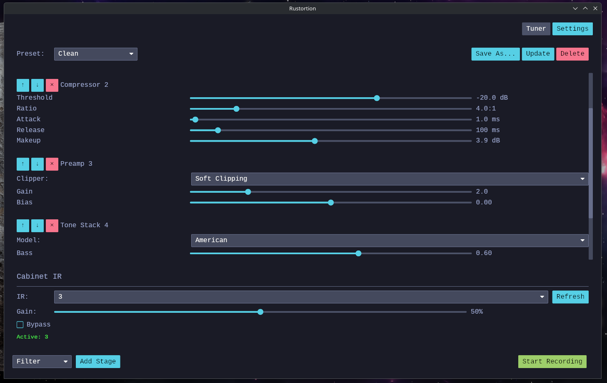

# Rustortion

[English](README.md) | 简体中文

一款使用 Rust 和 JACK 构建的吉他音箱模拟器。

## 截图



## 功能特性

- 低延迟音频处理，支持可配置的过采样
- 多级音箱模拟（前级放大、压缩器、音色堆栈、后级放大等）
- 支持吉他和贝斯的脉冲响应箱体模拟
- 预设的保存与加载
- 实时录音功能
- 内置调音器
- 基础 MIDI 控制器支持
- 使用 [Iced](https://github.com/iced-rs/iced) 构建的图形界面

## 系统要求

- **Linux** 系统，需启用 PipeWire（开启 JACK 支持）
- **Rust** 工具链：[安装 Rust](https://rustup.rs/)

> [!NOTE]
> 本项目已在 Raspberry Pi 4 和较高配置的台式电脑上测试通过。在其他硬件上的表现可能有所不同。

## 运行方式

### 预编译二进制文件

您可以从 [发布页面](https://github.com/OpenSauce/rustortion/releases/) 下载预编译的二进制压缩包。

```bash
sudo apt-get install libjack-jackd2-0
tar -xf rustortion-x86_64-unknown-linux-gnu.tar.xz
cd rustortion-x86_64-unknown-linux-gnu
./rustortion
```

### 从源码运行/编译

安装好 Rust 工具链后，您可以克隆仓库并运行应用程序：

```bash
sudo apt-get install libjack-jackd2-dev libasound2-dev pkg-config
cargo run --release
```

> [!TIP]
> 在某些使用 PipeWire 的 Linux 机器上，您可能需要显式运行 JACK：
> ```bash
> sudo apt-get install pipewire-jack
> pw-jack cargo run --release
> ```

## 参与贡献

这是一个实验性项目。欢迎提交 issue 或 pull request。

## 许可证

本项目基于 **MIT License** 提供。

Rustortion 正在积极开发中，使用风险自负。

### 脉冲响应

#### Science Amplification

本项目包含经 [Science Amplification](https://www.scienceamps.com/) 授权使用的脉冲响应。

#### 其他

本项目还包含来自 [freesound.org](https://freesound.org/) 的自由授权脉冲响应：

- [Multiple Cabinets – Jesterdyne](https://freesound.org/people/jesterdyne/)
- [Bristol Mix – Mansardian](https://freesound.org/people/mansardian/sounds/648392/)
- [Brown Cab – Tosha73](https://freesound.org/people/tosha73/sounds/507167/)
